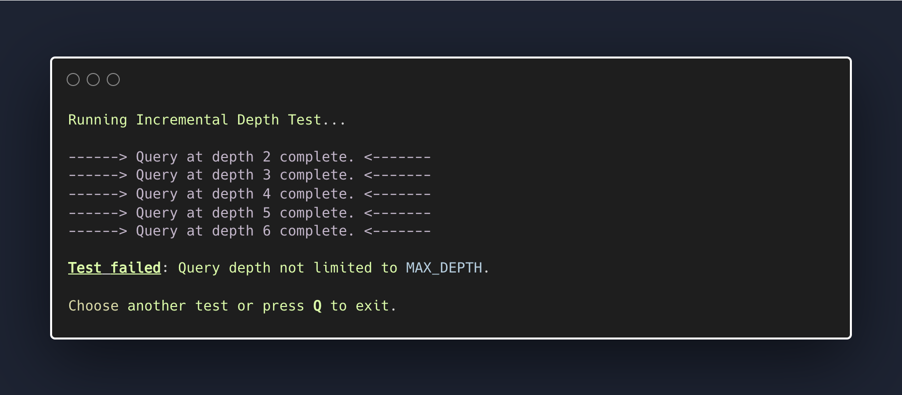
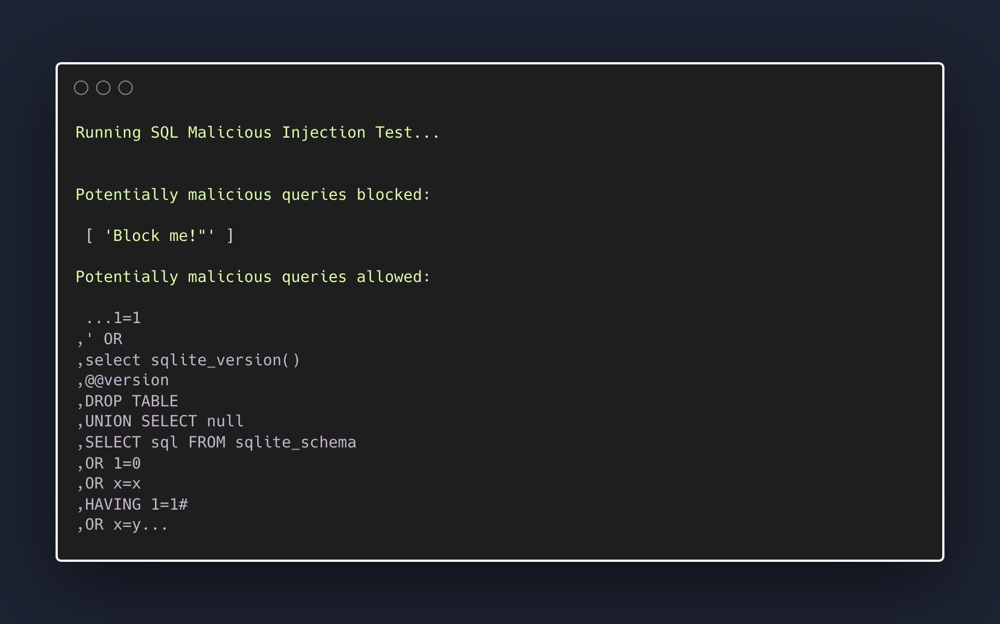

<h1 align="center">Welcome to Qevlar</h1>
<p align="center">
  <a href="https://www.npmjs.com/package/qevlar" target="_blank">
    
  </a>
  <a href="https://github.com/oslabs-beta/Qevlar/graphs/commit-activity" target="_blank">
    
  </a>
</p>

> GraphQL Security Testing Library

<!--
Banner Image
Short descrition of the product
Test Overview Section w/snippets
Install
Setup section
Contribution
Future Direction
Meet the Team
License
Show support

-->

##

### [qevlar.dev](qevlar.dev)

Qevlar is a dependency-free security testing library for GraphQL APIs that runs directly from your CLI. It assesses vulnerabilities to a multitude of DoS attacks, malicious SQL/NoSQL injections, and more.

## Test Overview

#### Select test from test menu:


#### Query depth limiting test example:



#### SQL injection test example:



#### Rate limiting test example:


## Installation

```sh
npm install qevlar
```

## Setup

1. Run start command:

```
npm run qevlar
```

2. To manually customize config, edit the relevant fields in `qevlarConfig.json`. It is initialized
3. To generate `qevlarConfig.json` automatically, select 0 in your CLI and submit your API's URL when prompted. This will introspect your Graph QL API, aquiring field names, then automatically update `qevlarConfig.json`.
4. After, select the test you want to run. Results will be displayed in your CLI.

## Contributing

Contributions, issues and feature requests are welcome!<br />

### Branch management

Please submit any pull requests to the dev branch. All changes will be reviewed before merging by OSLabs and prior contributors.

### Bugs and suggestions

For help with existing issues, please read our GitHub [issues page](https://github.com/oslabs-beta/qevlar/issues).
If you cannot find support in the issues page, please file a report on the same issues page.

Suggestions and other feedback are more than welcome.

## Meet the team 🧑‍🚀

Joshua McDaniel [GitHub](https://github.com/joshuamcdaniel95) | [LinkedIn](https://www.linkedin.com/in/joshuamcdanielxyz/) | [Email](jwilliammcdaniel@gmail.com)<br />
Conor Bell [GitHub](https://github.com/conorbell) | [LinkedIn](https://www.linkedin.com/in/conor-bell/) | [Email](conorbell27@gmail.com)<br />
Hyung Noh [GitHub](https://github.com/johniskorean) | [LinkedIn](https://www.linkedin.com/in/johniskorean/) | [Email](johnhyungilnoh@gmail.com)<br />
Landon Osteen [GitHub](https://github.com/LandonOsteen) | [LinkedIn](https://www.linkedin.com/in/landonosteen/) | [Email](landonwyatteosteen@gmail.com)
<br />
<br />
We're just a couple devs who love open-source solutions.

GitHub stars are welcomed, but really we're happy just building things people want to use.

Check Qevlar out on LinkedIn [here](https://www.linkedin.com/company/qevlarxyz/about/).

## License

_This project is [ISC](https://github.com/oslabs-beta/Qevlar/blob/master/LICENSE) licensed._
